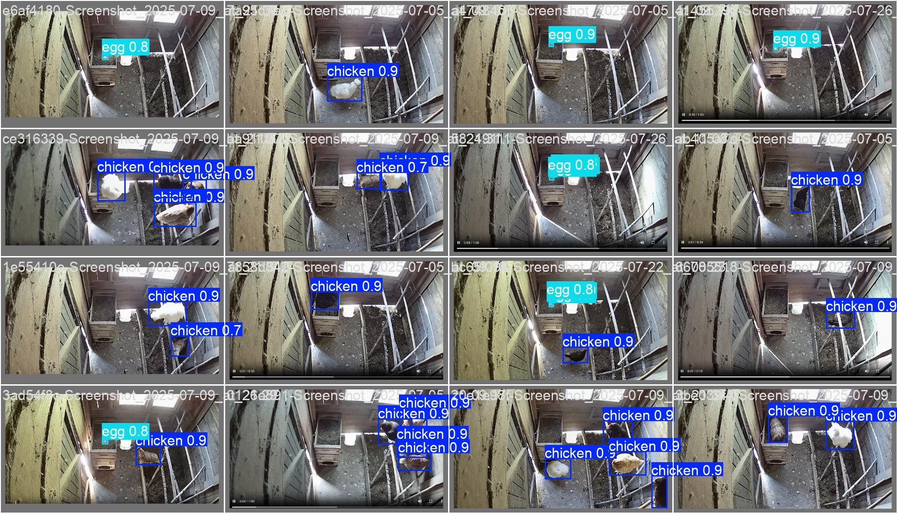

# 🐔 Henhouse Monitor

> **AI-powered chicken and egg detection for smart farms and backyard coops**

Henhouse Monitor is an intelligent computer vision system that automatically detects and counts chickens and eggs in your coop, then seamlessly integrates with Home Assistant to track your flock's activity and egg production.



## ✨ Features

- **🔍 Real-time Detection**: Advanced YOLO-based computer vision to accurately detect chickens and eggs
- **🏠 Home Assistant Integration**: Automatic MQTT publishing with device discovery
- **📸 Flexible Image Sources**: Support for both local files and remote URLs (cameras, webcams)
- **🐳 Docker Ready**: Easy deployment with Docker and Docker Compose
- **🔄 Continuous Monitoring**: Configurable detection intervals for ongoing surveillance
- **🎯 Custom Training**: Train your own models with Label Studio integration
- **⚡ Lightweight**: Optimized for CPU inference with ONNX runtime

## 🚀 Quick Start

### Prerequisites

- Python 3.13+
- [uv](https://docs.astral.sh/uv/) package manager
- MQTT broker (for Home Assistant integration)
- Docker (optional, for containerized deployment)

### Installation

1. **Clone the repository**
   ```bash
   git clone https://github.com/matitalatina/henhouse.git
   cd henhouse
   ```

2. **Install dependencies with uv**
   ```bash
   uv sync
   ```

3. **Configure environment variables**
   ```bash
   # Copy and edit the environment file
   cp .env.example .env
   
   # Edit .env with your MQTT broker settings
   MQTT_HOST=your-mqtt-broker-ip
   MQTT_USERNAME=your-mqtt-username
   MQTT_PASSWORD=your-mqtt-password
   IMAGE_SOURCE=url  # or "file"
   IMAGE_URL=http://your-camera-ip/snapshot.jpg
   ```

### Running the Service

#### Option 1: Using uv (Recommended)

```bash
# Run with uv
uv run python main.py
```

#### Option 2: Using Docker Compose

```bash
# Create .env file with your configuration first
docker-compose up -d
```

The service will:
- Load the pre-trained YOLO model (`models/henhouse.onnx`)
- Connect to your MQTT broker
- Register with Home Assistant via MQTT discovery
- Start continuous monitoring (every 15 minutes by default)

## 🏠 Home Assistant Integration

Once running, Henhouse Monitor automatically creates two sensors in Home Assistant:

- **`sensor.henhouse_monitor_eggs`**: Current egg count
- **`sensor.henhouse_monitor_chickens`**: Current chicken count

These sensors appear as a "Henhouse Monitor" device with appropriate icons (🥚 for eggs, 🐦 for chickens).

### Configuration Options

Configure the service using environment variables:

| Variable | Default | Description |
|----------|---------|-------------|
| `MQTT_HOST` | `localhost` | MQTT broker hostname |
| `MQTT_PORT` | `1883` | MQTT broker port |
| `MQTT_USERNAME` | `""` | MQTT username |
| `MQTT_PASSWORD` | `""` | MQTT password |
| `MQTT_USE_TLS` | `false` | Enable TLS for MQTT |
| `IMAGE_SOURCE` | `file` | Image source: `file` or `url` |
| `IMAGE_URL` | `not_set` | URL for camera snapshot |
| `IMAGE_FILE` | `snapshot.jpeg` | Local image file path |
| `LOG_LEVEL` | `INFO` | Logging level |

## 🏷️ Training Your Own Model

### Setting Up Label Studio

To annotate new images for training:

```bash
cd yolo
make label
```

This starts Label Studio on `http://localhost:8080` with your local data mounted.

### Training Process

1. **Prepare your dataset**: Add images to `yolo/dataset/project/images/`
2. **Annotate with Label Studio**: Use the web interface to label chickens and eggs
3. **Export annotations**: Export in YOLO format to `yolo/dataset/project/labels/`
4. **Train the model**:
   ```bash
   cd yolo
   uv run python main.py
   ```

The training script will:
- Load a pre-trained YOLO11s model
- Train on your custom dataset for 100 epochs
- Export the trained model in ONNX format
- Save results to the `models/` directory

### Dataset Structure

```
yolo/dataset/
├── data.yaml              # Dataset configuration
├── autosplit_train.txt     # Training image list
├── autosplit_val.txt       # Validation image list
└── project/
    ├── images/             # Training images
    └── labels/             # YOLO format annotations
```

## 🐳 Docker Deployment

### Build and Run

```bash
# Build the image
docker build -t henhouse .

# Run with environment variables
docker run -d \
  --name henhouse \
  -e MQTT_HOST=your-broker \
  -e IMAGE_URL=http://your-camera/snapshot.jpg \
  henhouse
```

### Docker Compose

```yaml
services:
  henhouse:
    build: .
    container_name: henhouse
    restart: unless-stopped
    environment:
      - MQTT_HOST=your-broker
      - IMAGE_URL=http://your-camera/snapshot.jpg
      - LOG_LEVEL=INFO
```

## 🔧 Development

### Project Structure

```
henhouse/
├── main.py                 # Main detection service
├── models/                 # Trained YOLO models
│   ├── henhouse.onnx       # Production model (ONNX)
│   ├── henhouse.pt         # PyTorch model
│   └── yolo11s.pt          # Base pre-trained model
├── yolo/                   # Training pipeline
│   ├── main.py             # Training script
│   ├── Makefile            # Label Studio commands
│   └── dataset/            # Training data
├── docker-compose.yml      # Docker deployment
├── Dockerfile              # Container definition
└── pyproject.toml          # Dependencies
```

### Dependencies

The project uses specific PyTorch CPU builds for optimal performance:

```toml
[tool.uv.sources]
torch = [{ index = "pytorch-cpu" }]
torchvision = [{ index = "pytorch-cpu" }]
```

## 📊 Performance

- **Inference Time**: ~2-3 seconds per image on CPU
- **Memory Usage**: ~200MB runtime memory
- **Accuracy**: >95% detection rate on well-lit coop images
- **Model Size**: 36MB (ONNX), 18MB (PyTorch)

## 🤝 Contributing

Contributions are welcome! Please feel free to submit a Pull Request. Areas where help is appreciated:

- 🎯 Improving detection accuracy
- 📱 Mobile app development
- 🔌 Additional smart home integrations
- 📚 Documentation improvements
- 🐛 Bug reports and fixes

## ❤️ Support This Project

If Henhouse Monitor helps you manage your flock more effectively, consider supporting its development:

- **⭐ Star this repository** to help others discover it
- **☕ Buy me a coffee** to fuel late-night coding sessions

### Sponsor

Your support helps maintain and improve this project:

[](https://www.buymeacoffee.com/mattianatali)
[](https://paypal.me/mattianatali)
[](https://github.com/sponsors/matitalatina)

## 📄 License

This project is licensed under the MIT License - see the [LICENSE](LICENSE) file for details.

## 🙏 Acknowledgments

- Built with [Ultralytics YOLO](https://github.com/ultralytics/ultralytics)
- Home Assistant integration via [ha-mqtt-discoverable](https://github.com/unixorn/ha-mqtt-discoverable)
- Label Studio for annotation workflow

---

<div align="center">
  
**Happy farming! 🐔🥚**

*Made with ❤️ from Italy!*

</div>
